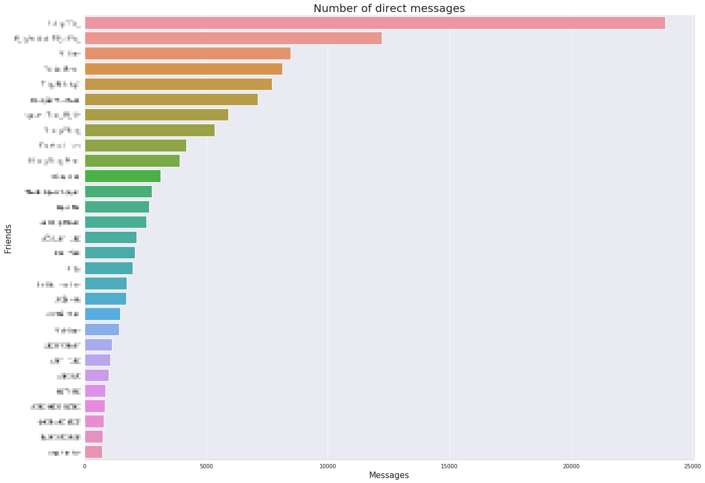
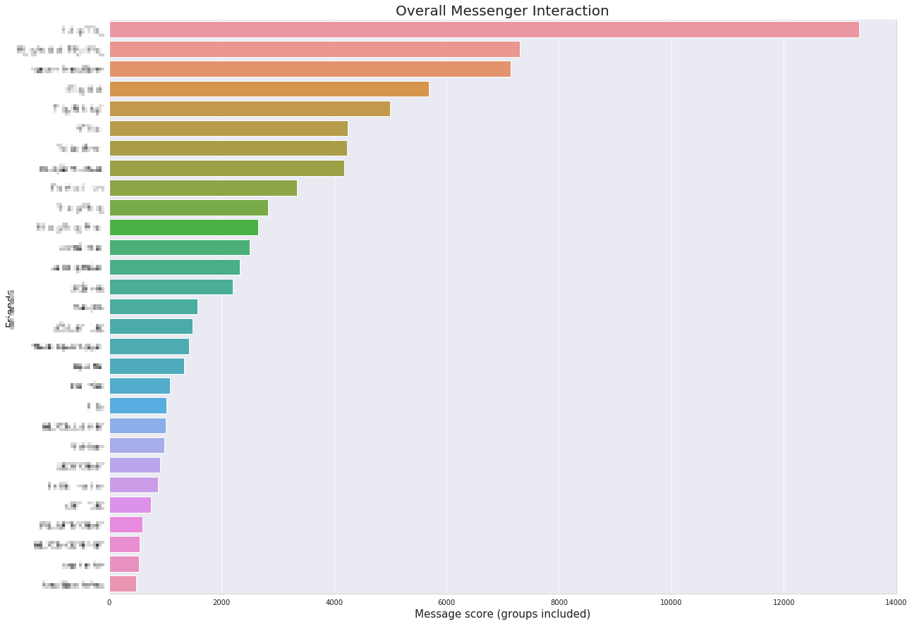
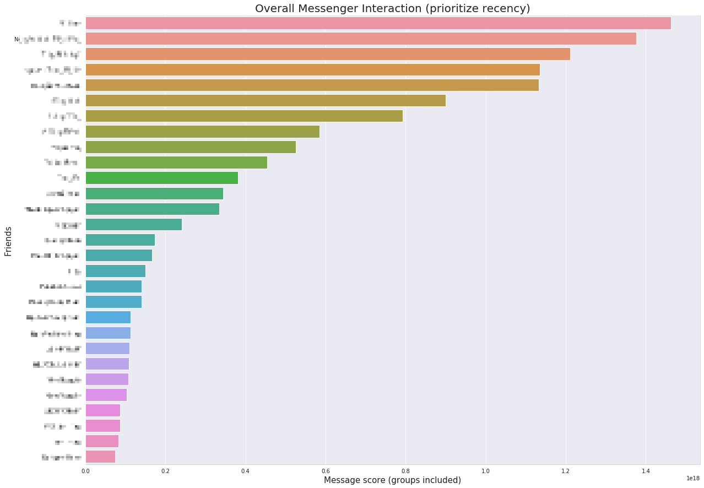
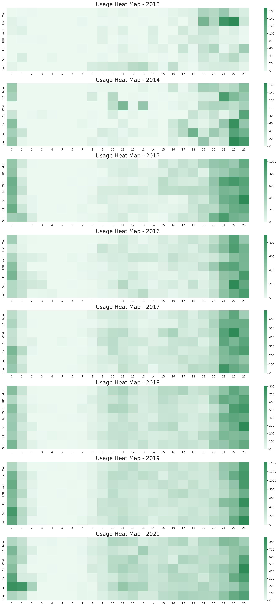

# facebook-messenger-data-visualization
One day I just want to find out who I spent most time with over last 7 years on Facebook Messenger

Code in `main.ipynb`. Download your Facebook Messenger data and put the extracted folder under this directory.

The expected structure is:
```
messages
├── archived_threads
├── filtered_threads
├── inbox
├── message_requests
└── stickers_used
```

Visualizations:

## Top friends by number of direct messages


## Top friends by number of messages including mutual group
The smaller the group is, the higher score it gets.


## Top friends by number of messages including mutual group, but with datetime accounted


## Usage Heatmap Over Years


## Top phrases
You must pick ones that you find interesting on your own =)). This code doesn't filter non-sense messages for you. ^^

![top-phrases][parrot_new.png]

Note: You can use other mask in top phrases visualization by modifying code from [this library](https://github.com/amueller/word_cloud/tree/master/examples).


### References
[Word Cloud](https://github.com/amueller/word_cloud/tree/master)
